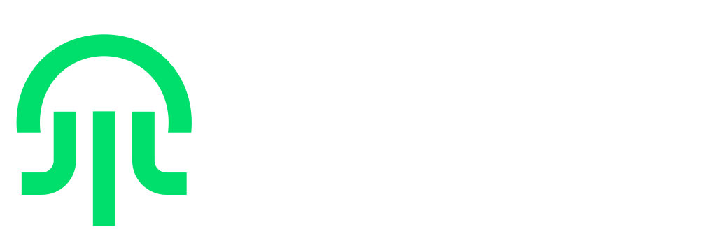
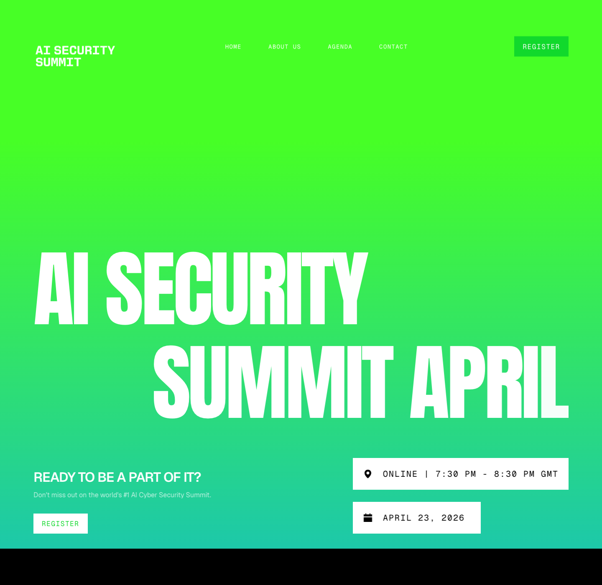
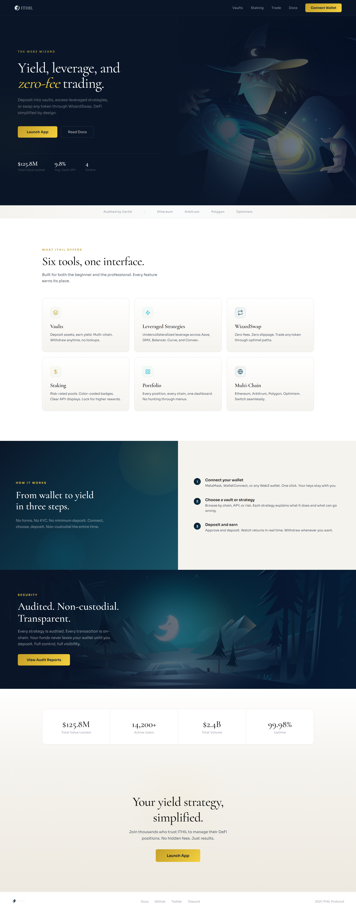
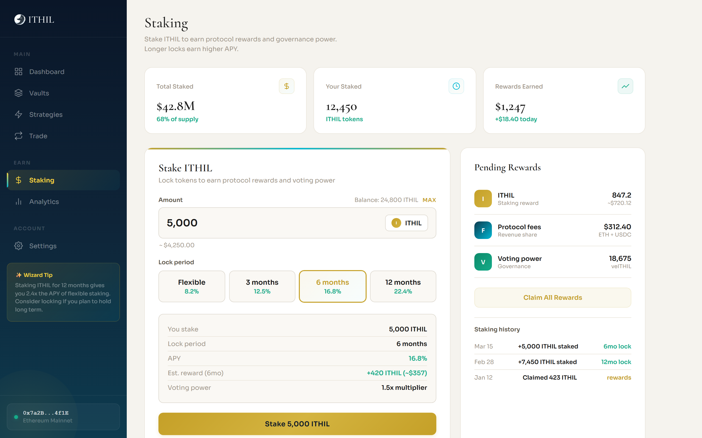
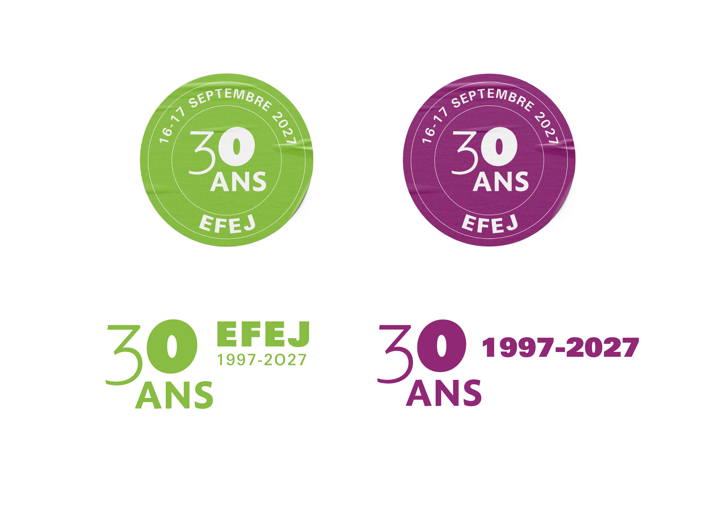
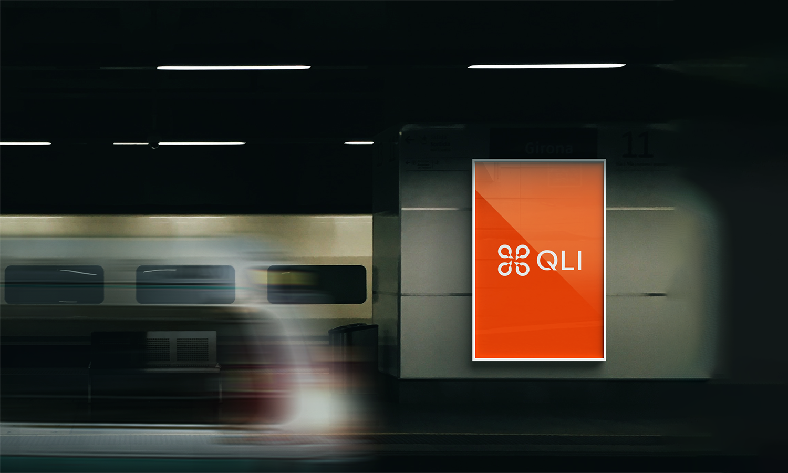
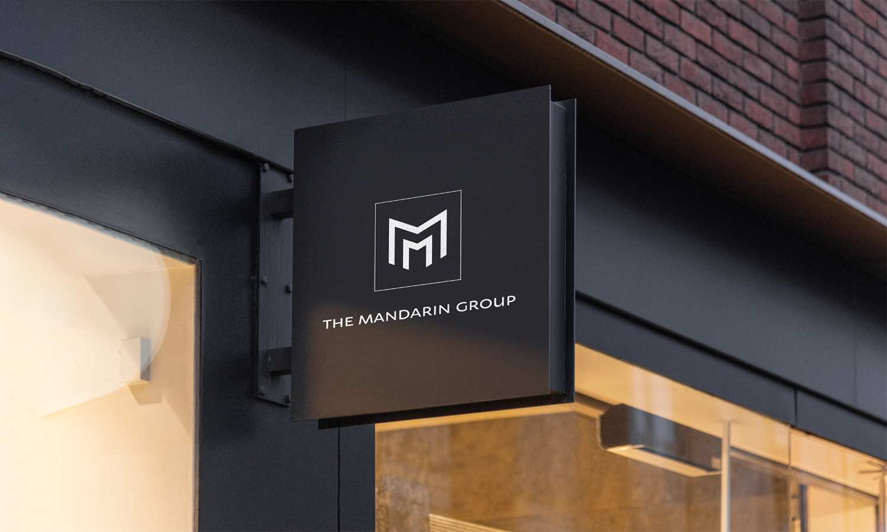

# portfolio-assets

Source images for the case studies on [gocepetrov.com](https://www.gocepetrov.com). I'm a brand designer; the full story of each project, the brief and what I did, is on its case page.

## ARKO for DevSecAI

Brand and product UI for an AI security extension. [Case study](https://www.gocepetrov.com/work/arko)

## AI Security Summit

Logo, brand and Framer site for an online AI security summit. [Case study](https://www.gocepetrov.com/work/ai-security-summit)

## ITHIL

Positioning and platform UI for a DeFi platform, from landing page to staking. [Case study](https://www.gocepetrov.com/work/ithil)

## EFEJ, 30 years

Event identity for the 30th anniversary open days of a training centre for job seekers. [Case study](https://www.gocepetrov.com/work/efej)

## Brand identity

Selected identities from ten years of brand work. [Case study](https://www.gocepetrov.com/work/brand-identity)

## Folders

| Folder | Content |
|---|---|
| `arko/` | ARKO logo |
| `ai-summit/` | Summit logo and landing page sections |
| `ithil/` | ITHIL landing, dashboard, trade, vaults and staking screens |
| `efej/` | EFEJ logo, posters, flyer, invitation, roll-up, signage and merchandise |
| `brand/` | Brand identity work for several clients |
| `testimonials/` | Photos shown next to client testimonials on the site |
| `about/`, `signature/` | My portrait, my G mark and email signature images |

## Use

These are source files for the website. The work belongs to the clients named on each case page. Please do not reuse it.
